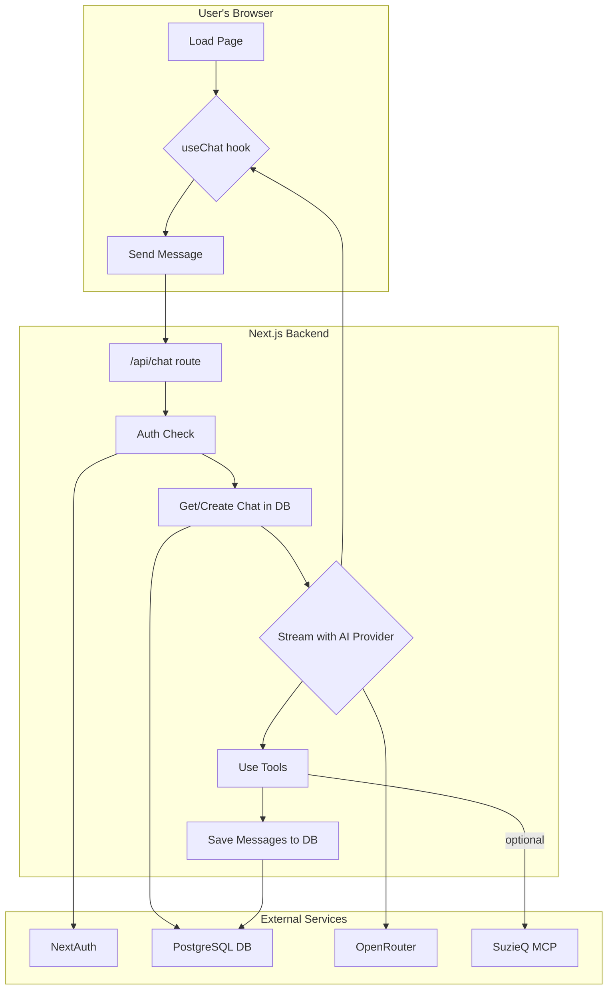

# CyberTraceAI-Ops – Codebase Reference Guide

This document is a developer-focused tour of the codebase architecture and patterns. For deployment instructions, see [README.md](README.md). For API specifications, see [API.md](API.md).

**Quick Navigation for Developers:**
- [Architecture Overview](#1-big-picture-overview) - High-level system design
- [Component Patterns](#4-detailed-component-reference) - How components interact
- [Database Architecture](#43-lib) - ORM patterns and data flow
- [AI Integration](#ai-integration-patterns) - LLM streaming and tool patterns

## Table of Contents

1. [Architecture Overview](#1-architecture-overview)
2. [Technology Stack & Patterns](#2-technology-stack--patterns)
3. [Directory & File Structure](#3-directory--file-structure)
4. [Component Architecture](#4-component-architecture)
   - [4.1 App Router & Pages](#41-app-router--pages)
   - [4.2 UI Components & Patterns](#42-ui-components--patterns)
   - [4.3 Business Logic & Data Layer](#43-business-logic--data-layer)
   - [4.4 Utility Scripts](#44-utility-scripts)
   - [4.5 Testing Strategy](#45-testing-strategy)
5. [AI Integration Patterns](#5-ai-integration-patterns)
6. [Database Architecture](#6-database-architecture)
7. [State Management Patterns](#7-state-management-patterns)
8. [Development Guidelines](#8-development-guidelines)
9. [Component Reference](#9-component-reference)

---

## 1. Architecture Overview

### Purpose

CyberTraceAI-Ops is a Next.js 14 (App-Router) application that lets operators chat in natural language about the state of their network.

- It authenticates users with Google OAuth via NextAuth
- Messages are streamed to Claude 3.5 Sonnet or GPT-4o through OpenRouter
- Optional SuzieQ MCP containers are launched on-demand so the AI can run network queries (via run*suzieq*\* tools)
- Chat history and user accounts live in a PostgreSQL database accessed with Drizzle ORM
- The whole stack ships in Docker / Docker-Compose for a "run and forget" deployment

### Runtime flow

1. Browser loads `/` (`app/page.tsx`)
2. React client establishes a NextAuth session (cookie‐based, db-stored)
3. When the user sends a message, `useChat` POSTs to `app/api/chat/route.ts`
4. The route:
   - ensures the user exists (`getOrCreateUser`)
   - creates or retrieves a chat row
   - streams AI completion (`streamText`) with the internal tool-set
   - saves the assistant/user messages in `message` table
5. Results stream back to the browser; the sidebar is refreshed



---

## 2. Technology Stack & Patterns

- **UI** – React 18, Next.js App Router, Tailwind CSS
- **State/UX** – React Server Components, AI-SDK `useChat` hook
- **Auth** – NextAuth + Drizzle adapter + Google OAuth
- **DB / ORM** – PostgreSQL 15, Drizzle ORM, SQL migrations in `/lib/db/migrations`
- **AI providers** – OpenRouter (Claude & GPT-4o), optional SuzieQ MCP docker
- **Tooling** – pnpm, ESLint, PostCSS, Tailwind, Sonner toasts, Lucide icons
- **Deployment** – Multi-stage Dockerfile + `docker-compose*.yml`

---

## 3. Directory & File Structure

```text
.
├── app/                      # Next.js 14 App Router
│   ├── api/                  # API routes (server-side)
│   │   ├── auth/[...nextauth]/route.ts  # NextAuth session handler
│   │   ├── chat/route.ts     # Core chat streaming endpoint
│   │   └── chats/            # CRUD for chat history
│   ├── auth/                 # Branded sign-in pages
│   └── page.tsx              # Main chat UI (client-side)
├── components/               # All React components
│   ├── ui/                   # Generic, reusable widgets (shadcn)
│   ├── providers/            # React context providers
│   ├── sidebar/              # Chat history drawer
│   └── *.tsx                 # Root-level chat components
├── lib/                      # Business logic, DB, and AI
│   ├── ai/                   # AI prompts and tools
│   ├── auth.ts               # NextAuth configuration
│   ├── db/                   # Drizzle ORM schema and queries
│   └── utils/                # Helper functions
├── public/                   # Static assets (images, etc.)
├── scripts/                  # Standalone utility scripts
├── tests/                    # E2E test suite for Docker stack
├── Dockerfile                # Multi-stage production build
├── docker-compose.yml        # Main Docker Compose stack
├── next.config.ts            # Next.js app configuration
└── tailwind.config.ts        # Tailwind CSS settings
```

---

## 4. Component Architecture

### 4.1 App Router & Pages

#### `layout.tsx`
Global HTML wrapper. Loads `SessionProvider`, `ThemeProvider` and the Sonner `<Toaster>` for notifications.

#### `page.tsx`
Client-side chat screen. Uses `useChat` (from `@ai-sdk/react`) to stream messages, toggles sidebar, and renders:

- `<SidebarToggle>` header button
- `<Sidebar>` (drawer) containing chat history
- `<MessagesList>` (scrolling message pane)
- `<ChatInput>` (stick-to-bottom textarea)

#### `auth/signin/page.tsx` & `auth/error/page.tsx`
Branded sign-in UI and error fallback, populated with dynamic NextAuth providers.

#### API Routes Architecture

**For complete API specifications, see [API.md](API.md)**

- **`api/auth/[...nextauth]/route.ts`** – NextAuth.js integration point
- **`api/chat/route.ts`** – **Core streaming endpoint** (≈ 260 LOC):
  - Session validation and user management
  - Chat lifecycle management (creation/retrieval)
  - AI streaming with tool integration
  - Message persistence during streaming
- **`api/chats/route.ts`** & **`api/chats/[id]/route.ts`** – CRUD operations for chat management

**Key Architectural Pattern**: Streaming-first design with automatic fallback and real-time message persistence.

### 4.2 UI Components & Patterns

#### Chat Flow Architecture

**Message Rendering Pipeline**:

1. **AI SDK Integration**: `MessagesList` processes `Message[]` from `@ai-sdk/react`
2. **Tool-aware Rendering**: Sophisticated handling of message parts:
   - **Text Parts**: Standard message bubbles via `IndividualMessage`
   - **Tool Invocations**: Dynamic rendering based on tool type
   - **Special Tools**: `table_tool` gets dedicated `TableDisplay` component
   - **Generic Tools**: Collapsible `Accordion` with JSON inspection

**Key Component Patterns**:

- **`ChatInput.tsx`** – Auto-resizing textarea with keyboard shortcuts
  ```typescript
  // Shift+Enter: newline, Enter: send
  onKeyDown: (e) => {
    if (e.key === 'Enter' && !e.shiftKey) {
      e.preventDefault()
      handleSubmit()
    }
  }
  ```

- **`MessagesList.tsx`** – **Core message orchestrator** with:
  - Auto-scroll to latest message
  - Streaming state management
  - Smart copy button visibility logic
  - Tool result differentiation

- **`IndividualMessage.tsx`** – Message bubble with markdown rendering
- **`ThinkingMessage.tsx`** – Animated typing indicator during streaming

**Streaming State Flow**:
```
idle → submitted → streaming → ready
  ↓        ↓          ↓        ↓
Empty   Thinking   Live     Copy
State   Shown      Updates  Enabled
```

#### Sidebar drawer (`components/sidebar/`)

- **`sidebar.tsx`** – Sheet + internal scroll area
- **`sidebar-header.tsx`** – Title + "new chat" button
- **`chat-history.tsx`** – Grouped chat list (last 7 days, 30 days, older)
- **`chat-item.tsx`** – Single row with dropdown menu (delete)
- **`profile-section.tsx`** – Avatar, sign-in/out buttons (not expanded above)
- **`sidebar-toggle.tsx`** – Hamburger used in mobile header

#### Generic widgets (`components/ui/`)

All exported via barrel for re-use (Button, DropdownMenu, Card, Table…). Particularly:

- **`table.tsx`** – low-level semantic table skeleton (Tailwind)
- **`table-display.tsx`** – convenience renderer for `TableData` generated by `lib/ai/tools/table.ts`

#### Providers

- **`providers/session-provider.tsx`** – Thin wrapper around `<SessionProvider>` from NextAuth
- **`providers/theme-provider.tsx`** – Simple light/dark toggle saved to localStorage + HTML class

#### React Patterns & Hooks

- **`useCopyMessageHandler.ts`** – Copy-to-clipboard with toast feedback
- **Auto-scroll Pattern**: `useEffect` + `scrollIntoView` for message updates
- **Optimistic UI**: Messages appear immediately, confirmed by streaming
- **State Lifting**: Chat state managed by `useChat` hook, passed down to components

### 4.3 Business Logic & Data Layer

#### Authentication Architecture (`auth.ts`)

**NextAuth.js Configuration Pattern**:

```typescript
// Simplified auth config structure
export const authOptions = {
  providers: [GoogleProvider({
    clientId: process.env.AUTH_GOOGLE_ID,
    clientSecret: process.env.AUTH_GOOGLE_SECRET,
  })],
  adapter: DrizzleAdapter(db, {
    usersTable: users,
    sessionsTable: sessions,
    // ... other tables
  }),
  callbacks: {
    session: ({ session, user }) => ({
      ...session,
      user: { ...session.user, id: user.id }
    })
  }
}
```

**Authentication Flow**:
1. **OAuth Initiation**: User clicks sign-in → Google OAuth
2. **Callback Processing**: Google returns to `/api/auth/callback/google`
3. **User Creation**: `DrizzleAdapter` creates/updates user in database
4. **Session Establishment**: Database-backed session with cookie
5. **Request Validation**: Each API call validates session via NextAuth

**Security Pattern**: Database sessions (not JWT-only) for revocability

#### Database Layer (`db/`)

**Schema Architecture** (`schema.ts`):
- **NextAuth Tables**: `user`, `account`, `session`, `verificationToken`
- **Domain Tables**: `chat`, `message`
- **Design Principles**: UUIDs, timestamps, referential integrity

**Query Layer** (`queries.ts`) – Repository pattern with ~250 LOC:
```typescript
// Example query pattern
export async function getOrCreateUser(email: string, name: string) {
  const [user] = await db.select().from(users).where(eq(users.email, email))
  if (!user) {
    return await db.insert(users).values({ email, name }).returning()
  }
  return user
}
```

**Key Query Functions**:
- `getOrCreateUser` – Idempotent user creation
- `createChat` – Chat lifecycle management
- `saveMessage` – Message persistence during streaming
- `getChatMessages` – Chat history with tool invocations

**Connection Management** (`index.ts`):
- Lazy connection instantiation
- Connection pooling via Drizzle
- Environment-based configuration

#### AI Integration Layer (`ai/`)

**Prompt Engineering** (`prompts.ts`):
- **System Prompt**: Comprehensive instructions for network analysis
- **Tool Guidance**: How to query SuzieQ and format results
- **Context Management**: Maintains conversation context across streaming

**Tool Architecture**:
```typescript
// Tool pattern example
export const tableTool = tool({
  description: 'Display data in formatted table',
  parameters: z.object({
    data: z.array(z.record(z.any())),
    title: z.string().optional(),
  }),
  execute: async ({ data, title }) => ({ data, title })
})
```

**Built-in Tools**:
- **`table.ts`** – Converts JSON → `TableData` for React rendering
- **`humanize-timestamp.ts`** – Epoch ms → human-readable dates

**Tool Loading Strategy**:
- **Static Tools**: Always available (table, timestamp)
- **Dynamic Tools**: MCP tools loaded when SuzieQ is available
- **Tool Registration**: Combined in `/api/chat/route.ts`

#### Utilities Layer

**Chat Title Generation** (`utils/chat-title.ts`):
```typescript
// Smart title generation from first message
export function generateChatTitle(message: string): string {
  // Truncate, clean, and format first user message
  return message.slice(0, 50).trim() + (message.length > 50 ? '...' : '')
}

export function shouldUpdateTitle(currentTitle: string): boolean {
  return currentTitle === 'New Chat' || currentTitle.startsWith('Chat ')
}
```

**Styling Utilities** (`utils.ts`):
- `cn()` – Combines clsx + tailwind-merge for conditional classes
- **Pattern**: `cn(baseClasses, conditionalClasses, props.className)`

### 4.4 Utility Scripts

––––––––––––––
Small Node.js utilities run with `pnpm tsx`:
• `setup-db.ts` Initialises schema locally.
• `update-chat-titles.ts` Back-fills titles for existing rows.
• `fix-user-id.ts` Data-migration helper.

### 4.5 Testing Strategy

**Integration Testing Approach**:

The project uses **Docker-based integration testing** rather than unit tests, reflecting the infrastructure-focused nature of the application.

**Test Suite** (`tests/test-suite.js`):
```javascript
// Full-stack integration tests
const tests = [
  'Application Health Check',
  'Database Connectivity & Schema',
  'NextAuth Provider Configuration', 
  'SuzieQ MCP Integration',
  'Docker Network Detection',
  'Environment Configuration'
]
```

**Testing Philosophy**:
- **End-to-End Focus**: Tests the complete deployed stack
- **Infrastructure Validation**: Docker, database, external services
- **Real Environment**: Tests against actual containers, not mocks
- **Deployment Verification**: Ensures production-like setup works

**Running Tests**: `./test-deployment.sh` (full Docker stack required)

**Test Coverage**:
- Container health and networking
- Database migrations and connectivity
- Authentication flow setup
- MCP tool integration
- API endpoint availability

---

## 5. AI Integration Patterns

### Streaming Architecture

The application implements a sophisticated streaming pattern for real-time AI interactions:

**Primary Streaming Flow**:
1. Client sends message via `useChat` hook (AI SDK)
2. Server validates session and manages chat lifecycle
3. AI provider streams response with tool calls
4. Messages persisted in real-time during streaming
5. Client receives streaming updates via Server-Sent Events

**Tool Integration Pattern**:
- **Internal Tools**: `humanize_timestamp`, `table` (built-in formatters)
- **External Tools**: SuzieQ MCP tools (containerized execution)
- **Dynamic Tool Loading**: Tools are conditionally available based on environment

**Error Recovery**: Multiple fallback strategies ensure reliable streaming even with network issues.

### MCP Container Management

The application dynamically manages Docker containers for tool execution:

```typescript
// Simplified container lifecycle
1. Tool call detected → Spawn MCP container
2. Execute tool with network auto-detection
3. Return results → Cleanup container
4. Network isolation & resource limits applied
```

**Network Detection Pattern**: Automatically detects Docker network configuration (Docker Desktop, Linux, Compose networks).

---

## 6. Database Architecture

### Schema Design Philosophy

**NextAuth Integration**: Extends standard NextAuth schema with domain-specific entities:
- `user`, `account`, `session`, `verificationToken` (NextAuth core)
- `chat`, `message` (application domain)

**Key Design Decisions**:
- UUIDs for all primary keys (distributed-friendly)
- Timestamp tracking on all entities
- JSON columns for flexible tool invocation storage
- Foreign key constraints maintain referential integrity

### Migration Strategy

**Pattern**: SQL-first migrations with Drizzle ORM
- Raw SQL files in `lib/db/migrations/`
- Incremental, reversible changes
- Production-safe migration practices

**Example Migration Pattern**:
```sql
-- 0004_nextauth_migration.sql
ALTER TABLE "user" ADD COLUMN "emailVerified" timestamp;
CREATE INDEX IF NOT EXISTS "user_email_idx" ON "user" ("email");
```

---

## 7. State Management Patterns

### Client-Side State Architecture

**React Server Components**: Minimizes client-side state by leveraging server rendering

**Key State Patterns**:
- **Chat State**: Managed by AI SDK `useChat` hook
- **Session State**: NextAuth `useSession` for authentication
- **UI State**: Local component state for toggles, modals
- **Theme State**: Context + localStorage for persistence

**Data Flow Pattern**:
```
Server Components → Client Components → API Routes → Database
     ↓                    ↑
  Static Data        Dynamic Updates
```

### Server State Synchronization

**Optimistic Updates**: Client immediately shows user messages, server confirms persistence
**Error Boundaries**: Graceful degradation when streaming fails
**Session Management**: Database-backed sessions with automatic renewal

---

## 8. Development Guidelines

### Adding Components

**UI Components**: Follow shadcn/ui patterns
```typescript
// components/ui/new-component.tsx
export const NewComponent = ({ className, ...props }) => {
  return (
    <div className={cn("base-styles", className)} {...props}>
      {/* Component content */}
    </div>
  )
}
```

**Domain Components**: Place in appropriate feature folders
- Chat-related: `components/` root
- Sidebar-related: `components/sidebar/`
- Auth-related: `components/auth/`

### Extending AI Tools

**Internal Tools**: Create in `lib/ai/tools/`
```typescript
// lib/ai/tools/new-tool.ts
import { z } from 'zod'
import { tool } from 'ai'

export const newTool = tool({
  description: 'Tool description for AI',
  parameters: z.object({...}),
  execute: async (params) => {...}
})
```

**Register in Chat Route**: Add to tools map in `app/api/chat/route.ts`

### Database Changes

**Schema Evolution Pattern**:
1. Edit `lib/db/schema.ts` with new structure
2. Generate migration: `pnpm db:generate`
3. Review generated SQL migration
4. Test migration on development data
5. Commit both schema and migration files

**Migration Best Practices**:
- Always backwards compatible
- Use `IF NOT EXISTS` for new tables/columns
- Include proper indexes
- Consider data migration scripts for complex changes

### Configuration & Environment

**For deployment configuration, see [README.md](README.md)**

**Development Environment**:
```bash
# Local development setup
cp .env.example .env.local
pnpm dev  # Hot reload enabled
```

**Environment Pattern**: Use Next.js environment variable conventions
- `NEXT_PUBLIC_*` for client-side variables
- No prefix for server-only variables
- Validate all env vars in `lib/auth.ts` and route handlers

---

## 9. Component Reference

| Component               | Responsibility & Patterns                         |
| ----------------------- | ------------------------------------------------ |
| `ChatInput`             | Auto-resizing textarea with keyboard shortcuts (Shift+Enter: newline, Enter: send) |
| `MessagesList`          | **Core orchestrator**: AI SDK message rendering, tool-aware display, auto-scroll |
| `IndividualMessage`     | Markdown message bubble with conditional copy button |
| `ThinkingMessage`       | Animated typing indicator during streaming states |
| `Sidebar`               | Responsive drawer with chat history and profile |
| `ChatHistory`           | Time-grouped chat list with API integration |
| `ChatItem`              | Chat row with contextual actions (delete, etc.) |
| `SidebarToggle`         | Mobile hamburger menu with responsive behavior |
| `TableDisplay`          | Specialized renderer for `table_tool` results |
| `Accordion`             | Collapsible tool invocation inspector |
| `ThemeProvider`         | Dark/light mode with localStorage persistence |
| `SessionProvider`       | NextAuth session context with error boundaries |
| `useCopyMessageHandler` | Copy-to-clipboard with toast feedback integration |

---

---

## Further Reading

- **[README.md](README.md)** - Deployment, configuration, and troubleshooting
- **[API.md](API.md)** - Complete API specification and integration examples
- **[CONTRIBUTING.md](CONTRIBUTING.md)** - Development setup and contribution guidelines

You now have a comprehensive understanding of the CyberTraceAI-Ops architecture and development patterns. This guide focuses on the technical implementation details that help you understand how the system works and how to extend it effectively.

**🌟 CyberTraceAI-Ops - Network Observability Through Natural Language**
