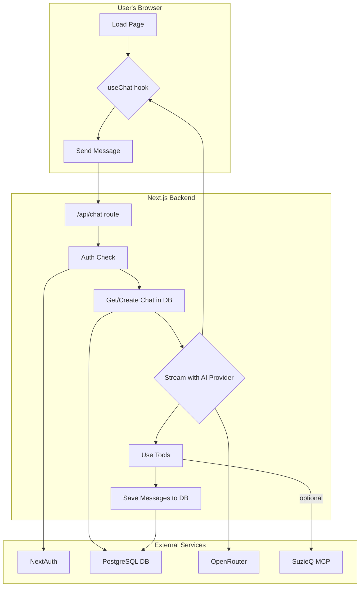

# CyberTraceAI-Ops – Codebase Reference Guide

This document is a self-contained tour of the whole repository. Read it top-down to understand how the pieces fit, or jump to any section when you need details on a particular file.

## Table of Contents

1. [Big-picture overview](#1-big-picture-overview)
2. [Technology stack at a glance](#2-technology-stack-at-a-glance)
3. [Directory & file map](#3-directory--file-map)
4. [Detailed component reference](#4-detailed-component-reference)
   - [4.1 `app/` – routes & pages](#41-app--routes--pages)
   - [4.2 UI & domain components](#42-ui--domain-components-components)
   - [4.3 `lib/`](#43-lib)
   - [4.4 `scripts/`](#44-scripts)
   - [4.5 `tests/`](#45-tests)
5. [Environment variables](#5-environment-variables-superset)
6. [Build & deployment artefacts](#6-build--deployment-artefacts)
7. [Extending / modifying](#7-extending--modifying)
8. [Glossary of key React components](#8-glossary-of-key-react-components)

---

## 1. Big-picture overview

### Purpose

CyberTraceAI-Ops is a Next.js 14 (App-Router) application that lets operators chat in natural language about the state of their network.

- It authenticates users with Google OAuth via NextAuth
- Messages are streamed to Claude 3.5 Sonnet or GPT-4o through OpenRouter
- Optional SuzieQ MCP containers are launched on-demand so the AI can run network queries (via run*suzieq*\* tools)
- Chat history and user accounts live in a PostgreSQL database accessed with Drizzle ORM
- The whole stack ships in Docker / Docker-Compose for a "run and forget" deployment

### Runtime flow

1. Browser loads `/` (`app/page.tsx`)
2. React client establishes a NextAuth session (cookie‐based, db-stored)
3. When the user sends a message, `useChat` POSTs to `app/api/chat/route.ts`
4. The route:
   - ensures the user exists (`getOrCreateUser`)
   - creates or retrieves a chat row
   - streams AI completion (`streamText`) with the internal tool-set
   - saves the assistant/user messages in `message` table
5. Results stream back to the browser; the sidebar is refreshed



---

## 2. Technology stack at a glance

- **UI** – React 18, Next.js App Router, Tailwind CSS
- **State/UX** – React Server Components, AI-SDK `useChat` hook
- **Auth** – NextAuth + Drizzle adapter + Google OAuth
- **DB / ORM** – PostgreSQL 15, Drizzle ORM, SQL migrations in `/lib/db/migrations`
- **AI providers** – OpenRouter (Claude & GPT-4o), optional SuzieQ MCP docker
- **Tooling** – pnpm, ESLint, PostCSS, Tailwind, Sonner toasts, Lucide icons
- **Deployment** – Multi-stage Dockerfile + `docker-compose*.yml`

---

## 3. Directory & file map

```text
.
├── app/                      # Next.js 14 App Router
│   ├── api/                  # API routes (server-side)
│   │   ├── auth/[...nextauth]/route.ts  # NextAuth session handler
│   │   ├── chat/route.ts     # Core chat streaming endpoint
│   │   └── chats/            # CRUD for chat history
│   ├── auth/                 # Branded sign-in pages
│   └── page.tsx              # Main chat UI (client-side)
├── components/               # All React components
│   ├── ui/                   # Generic, reusable widgets (shadcn)
│   ├── providers/            # React context providers
│   ├── sidebar/              # Chat history drawer
│   └── *.tsx                 # Root-level chat components
├── lib/                      # Business logic, DB, and AI
│   ├── ai/                   # AI prompts and tools
│   ├── auth.ts               # NextAuth configuration
│   ├── db/                   # Drizzle ORM schema and queries
│   └── utils/                # Helper functions
├── public/                   # Static assets (images, etc.)
├── scripts/                  # Standalone utility scripts
├── tests/                    # E2E test suite for Docker stack
├── Dockerfile                # Multi-stage production build
├── docker-compose.yml        # Main Docker Compose stack
├── next.config.ts            # Next.js app configuration
└── tailwind.config.ts        # Tailwind CSS settings
```

---

## 4. Detailed component reference

### 4.1 `app/` – routes & pages

#### `layout.tsx`
Global HTML wrapper. Loads `SessionProvider`, `ThemeProvider` and the Sonner `<Toaster>` for notifications.

#### `page.tsx`
Client-side chat screen. Uses `useChat` (from `@ai-sdk/react`) to stream messages, toggles sidebar, and renders:

- `<SidebarToggle>` header button
- `<Sidebar>` (drawer) containing chat history
- `<MessagesList>` (scrolling message pane)
- `<ChatInput>` (stick-to-bottom textarea)

#### `auth/signin/page.tsx` & `auth/error/page.tsx`
Branded sign-in UI and error fallback, populated with dynamic NextAuth providers.

#### API routes

- **`api/auth/[...nextauth]/route.ts`** – Thin wrapper exporting `authOptions`
- **`api/chat/route.ts`** – Core chat endpoint (≈ 260 LOC):
  - Validates session, creates chat row if needed
  - Spawns optional SuzieQ MCP docker client
  - Streams AI completion with tools (`humanize_timestamp_tool`, `table_tool`, plus MCP tools)
  - Persists each message with `saveMessage`
- **`api/chats/route.ts`** – List & create chats for the signed-in user
- **`api/chats/[id]/route.ts`** – GET/PATCH/DELETE single chat

### 4.2 UI & domain components (`/components`)

#### Chat flow

- **`ChatInput.tsx`** – Resizable textarea, Shift+Enter newline, Enter send
- **`MessagesList.tsx`** – Iterates over AI-SDK messages array and delegates:
  - Renders `<IndividualMessage>` for plain text
  - Renders `<TableDisplay>` for `table_tool` results
  - Wraps any other tool invocation in `<Accordion>` for collapsible JSON inspection
- **`IndividualMessage.tsx`** – User vs assistant bubble with markdown & "copy to clipboard" button (hook below)
- **`ThinkingMessage.tsx`** – Animated "assistant is typing…" placeholder

#### Sidebar drawer (`components/sidebar/`)

- **`sidebar.tsx`** – Sheet + internal scroll area
- **`sidebar-header.tsx`** – Title + "new chat" button
- **`chat-history.tsx`** – Grouped chat list (last 7 days, 30 days, older)
- **`chat-item.tsx`** – Single row with dropdown menu (delete)
- **`profile-section.tsx`** – Avatar, sign-in/out buttons (not expanded above)
- **`sidebar-toggle.tsx`** – Hamburger used in mobile header

#### Generic widgets (`components/ui/`)

All exported via barrel for re-use (Button, DropdownMenu, Card, Table…). Particularly:

- **`table.tsx`** – low-level semantic table skeleton (Tailwind)
- **`table-display.tsx`** – convenience renderer for `TableData` generated by `lib/ai/tools/table.ts`

#### Providers

- **`providers/session-provider.tsx`** – Thin wrapper around `<SessionProvider>` from NextAuth
- **`providers/theme-provider.tsx`** – Simple light/dark toggle saved to localStorage + HTML class

#### Hooks

- **`useCopyMessageHandler.ts`** – Handles the copy-to-clipboard toast logic

### 4.3 `lib/`

#### `auth.ts`

`createAuthOptions()` generates NextAuth config with:

- Google OAuth provider (IDs pulled from env)
- DrizzleAdapter → PostgreSQL session store
- `session` callback adds `user.id` to the JWT payload
- Custom sign-in / error pages mapping

• `db/`
– `schema.ts` – Drizzle schema for `user`, `account`, `session`,
`verificationToken`, plus domain-specific `chat` & `message`.
– `queries.ts` – Safe wrapper functions (≈ 250 LOC) for common DB ops:
`getOrCreateUser`, `createChat`, `saveMessage`, `getChatMessages`, etc.
– `migrations/*` – raw SQL migration snippets.
– `index.ts` – Connection helper; lazily creates a shared Drizzle instance.

• `ai/`
– `prompts.ts` – Large SYSTEM prompt guiding the assistant how to
query SuzieQ and format results.
– `tools/table.ts` – Zod-validated AI tool that converts JSON arrays
into strongly-typed `TableData` used by the React renderer.
– `tools/humanize-timestamp.ts` – AI tool that converts epoch ms
to readable date strings.
– `tools/*` imported in the chat route; combined with MCP tools when
SuzieQ docker is available.

• `utils/chat-title.ts`
Heuristic that turns the first user message into a concise chat title,
plus `shouldUpdateTitle()` guard.

• `utils.ts`
`cn()` – Tailwind class-name merger (clsx + tailwind-merge).

### 4.4 `scripts/`

––––––––––––––
Small Node.js utilities run with `pnpm tsx`:
• `setup-db.ts` Initialises schema locally.
• `update-chat-titles.ts` Back-fills titles for existing rows.
• `fix-user-id.ts` Data-migration helper.

### 4.5 `tests/`

––––––––––––
`test-suite.js` spins up the full Docker stack and asserts:
– containers are healthy,
– NextAuth endpoints respond,
– DB tables exist,
– SuzieQ MCP commands succeed.
Run via `./test-deployment.sh`.

---

## 5. Environment variables (superset)

| Variable                        | Purpose                                       |
| ------------------------------- | --------------------------------------------- |
| `NEXTAUTH_SECRET`               | Signed-cookie & JWT secret                    |
| `AUTH_GOOGLE_ID / SECRET`       | Google OAuth credentials                      |
| `POSTGRES_URL`                  | Drizzle/PostgreSQL connection string          |
| `OPENROUTER_API_KEY`            | Token to access Claude / GPT-4o               |
| `SUZIEQ_API_ENDPOINT`           | Base URL of SuzieQ REST API                   |
| `SUZIEQ_API_KEY`                | API key for the observability backend         |
| `MCP_DOCKER_NETWORK` (optional) | `auto` (default), `host`, or explicit network |

---

## 6. Build & deployment artefacts

- **`Dockerfile`** – multi-stage (builder → 90 MB alpine runtime)
- **`docker-compose.yml`** – app + db + optional MCP
- **`docker-compose.dev.yml`** – mounts source, enables hot-reload
- **`healthcheck.js`** – node script invoked by container health-check

---

## 7. Extending / modifying

- **Add a new UI component** → drop `.tsx` file under `components/` and import
- **Add a new AI tool** → create in `lib/ai/tools/`, export in the chat route's `tools` map
- **Change DB schema** → edit `lib/db/schema.ts`, run `pnpm db:generate` and commit the new migration under `lib/db/migrations/`

---

## 8. Glossary of key React components

| Component               | Responsibility (1-liner)                         |
| ----------------------- | ------------------------------------------------ |
| `ChatInput`             | Collects user text, auto-grows, sends on Enter   |
| `MessagesList`          | Scroll container rendering all message items     |
| `IndividualMessage`     | Markdown bubble + copy button                    |
| `ThinkingMessage`       | Animated “assistant is typing” placeholder       |
| `Sidebar`               | Drawer containing history + profile              |
| `ChatHistory`           | Groups chats by age, fetches via `/api/chats`    |
| `ChatItem`              | Single chat row with contextual delete menu      |
| `SidebarToggle`         | Mobile hamburger button                          |
| `TableDisplay`          | Turns `TableData` into a styled HTML table       |
| `ThemeProvider`         | Light/Dark mode toggle persisted to localStorage |
| `SessionProvider`       | NextAuth session context wrapper                 |
| `useCopyMessageHandler` | Clipboard helper with Sonner toast feedback      |

---

You now have a complete map of every directory and component in
CyberTraceAI-Ops. Happy hacking!

**🌟 CyberTraceAI-Ops - Answer whether simple or complex questions about your network using AI**
